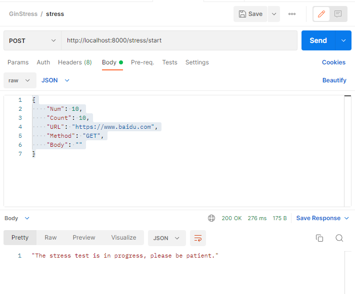

# 并发单http接口压测(GIN版)

以www.badiu.com为例

# 请求方式及入参



### 参数说明

```
{
    "Num": 10,                      协程数
    "Count": 10,                    每个协程请求数
    "URL": "https://www.baidu.com", 压测URl
    "Method": "GET",                接口请求方式
    "Body": ""                      接口入参
}
```

# 控制台log打印

```
2022/07/02 16:57:07 request body: &{10 10 https://www.baidu.com GET }
─────┬───────┬───────┬───────┬────────┬────────┬────────┬────────
 耗时│ 并发数│ 成功数│ 失败数│   qps  │最长耗时│最短耗时│平均耗时
─────┼───────┼───────┼───────┼────────┼────────┼────────┼────────
   1s│     10│    100│      0│  408.16│  119.00│   10.00│   24.50


*************************  结果 stat  ****************************
处理协程数量: 10 请求总数: 100 成功数: 100 失败数: 0
avg: 24.500
tp90: 104.000
tp95: 110.000
tp99: 119.000
*************************  结果 end   ****************************

[GIN] 2022/07/02 - 16:57:08 | 200 |    272.5662ms |             ::1 | POST     "/stress/start"

```
